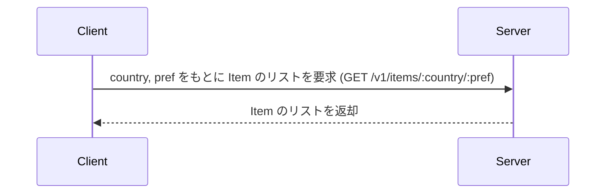
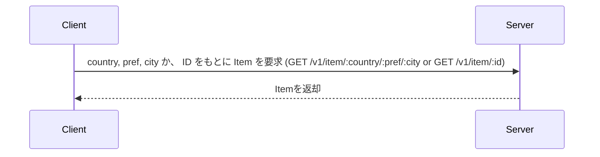
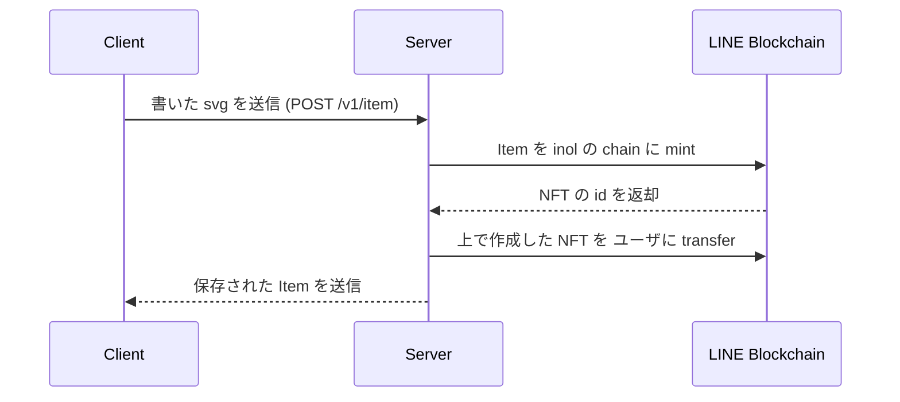
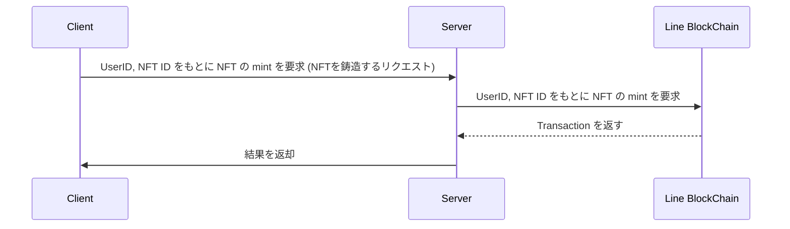

## Item を表示
### リスト表示

```mermaid
sequenceDiagram
	Client ->> Server: country, pref をもとに Item のリストを要求 (GET /v1/items/:country/:pref)
	Server -->> Client: Item のリストを返却
```

### 特定のItem を表示

```mermaid
sequenceDiagram
	Client ->> Server: country, pref, city か、 ID をもとに Item を要求 (GET /v1/item/:country/:pref/:city or GET /v1/item/:id)
	Server -->> Client: Itemを返却
```

## Item を保存

```mermaid
sequenceDiagram
	Client ->> Server: 書いた svg を送信 (POST /v1/item)
	Server ->> LINE Blockchain: Item を inol の chain に mint
	LINE Blockchain -->> Server: NFT の id を返却
	Server ->> LINE Blockchain: 上で作成した NFT を ユーザに transfer
	
	Server -->> Client: 保存された Item を送信
```

## NFT を自分の wallet に紐付ける

```mermaid
sequenceDiagram
	Client ->> Server: UserID, NFT ID をもとに NFT の mint を要求 (NFTを鋳造するリクエスト)
	Server ->> Line BlockChain:  UserID, NFT ID をもとに NFT の mint を要求
	Line BlockChain -->> Server: Transaction を返す
	Server ->> Client: 結果を返却
```
