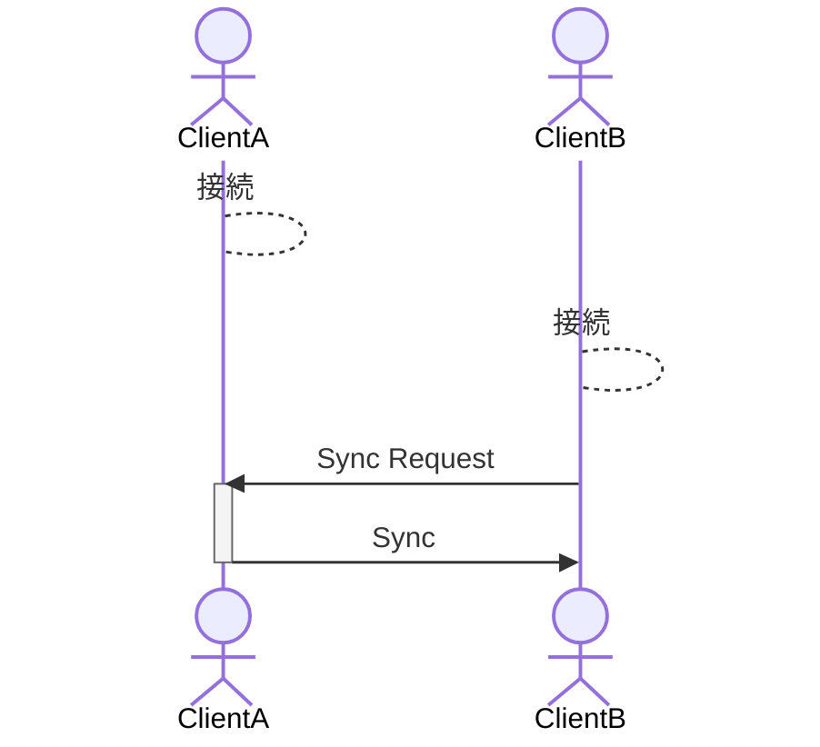
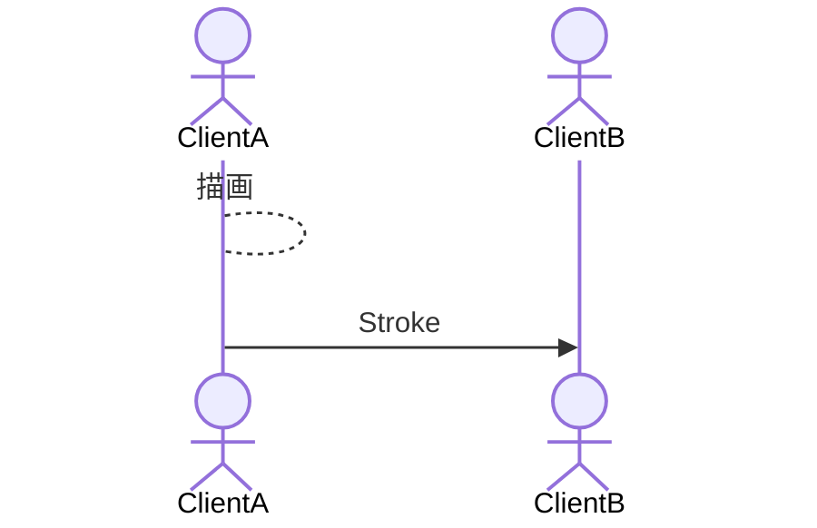
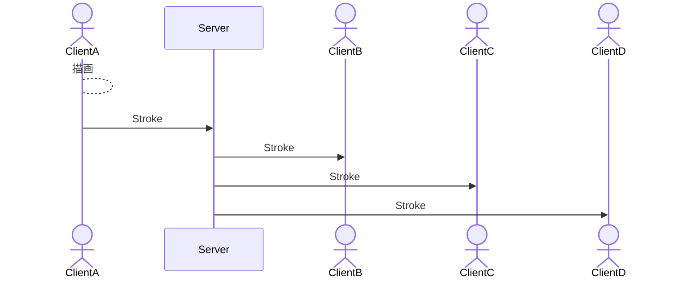

# キャンバス共有プロトコル

## 基本方針

中央集権的な、バックエンドで DB を持って…はリソースの管理が重くなりうるので避ける。
（フロントの難解さとトレードオフ）

これにより、フロントエンド間で通信ができれば良くなり通信方法の自由度は上がる。

## 接続

接続時、`Sync Request`を送信し、`Sync`を要求する。
`Sync`には全ストローク情報を含めることで同期を図る。

## 描画

描画毎にストローク情報を送信する。

## WebSocket などのサーバを介し、３人以上の場合

基本方針は変わらず、クライアントサイドに処理の重きを置く。

サーバはクライアントから送られてきた通信をブロードキャストする。

